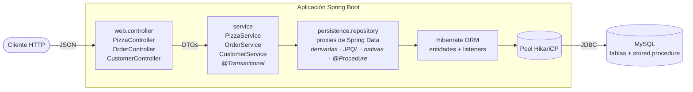
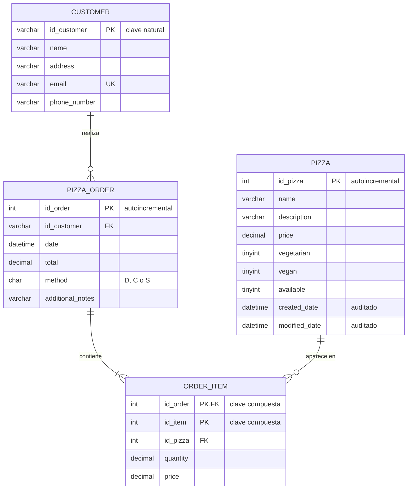
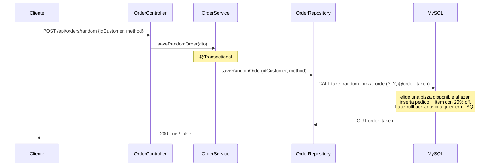

<div align="center">

# Spring Data JPA Showcase

**Una API REST con Spring Boot 4 que reúne las técnicas de persistencia de Spring Data JPA —desde consultas derivadas hasta stored procedures— como referencia funcional sobre MySQL.**


[English](README.md) · **Español**

</div>

---

## Índice

- [Acerca del proyecto](#acerca-del-proyecto)
- [Funcionalidades de Spring Data JPA](#funcionalidades-de-spring-data-jpa)
- [Stack tecnológico](#stack-tecnológico)
- [Arquitectura](#arquitectura)
- [Estructura del proyecto](#estructura-del-proyecto)
- [Instalación y uso](#instalación-y-uso)
- [Decisiones técnicas](#decisiones-técnicas)
- [Autor](#autor)

---

## Acerca del proyecto

Spring Data JPA tiene muchas formas de llegar a la base de datos: métodos cuyo nombre se convierte en consulta, JPQL, SQL nativo, proyecciones, consultas de modificación, stored procedures. Cada una es fácil de aprender por separado. Lo difícil es saber **cuándo conviene cada una**. Este proyecto las reúne en un código chico y ejecutable, con cada técnica detrás de su propio endpoint REST. Podés llamar al endpoint y leer el SQL que Hibernate registra en el log.

El código sigue un diseño clásico en tres capas (**controller → service → repository**) sobre Spring Boot 4, Hibernate 7 y MySQL. Cubre el mapeo de entidades, incluidas una clave natural y una clave compuesta, las asociaciones bidireccionales y las estrategias de carga. También cubre paginación y ordenamiento, límites transaccionales, auditoría JPA, callbacks del ciclo de vida de las entidades y la llamada a un stored procedure mediante `@Procedure`.

Los datos de ejemplo son un pequeño conjunto de pedidos, con productos, clientes, pedidos e ítems. Solo están para que las consultas trabajen sobre algo realista. El foco del repositorio es la **capa de persistencia**.

---

## Funcionalidades de Spring Data JPA

Cada funcionalidad está implementada en el código y se puede probar con un endpoint. La API completa está en [`docs/api.es.md`](docs/api.es.md).

| | Técnica | Dónde está en el código | Probala |
|---|---|---|---|
| 🔎 | **Consultas derivadas**: `True`, `IgnoreCase`, `Containing`, `NotContaining`, `First`, `Top3`, `LessThanEqual`, `OrderBy`, `After`, `In`, `countBy` | `PizzaRepository`, `OrderRepository` | `GET /api/pizzas/with/{ingredient}` |
| 📄 | **Paginación y ordenamiento** con `Pageable`, `PageRequest`, `Sort` y `Page<T>` | `PizzaPageSortRepository` (`ListPagingAndSortingRepository`) | `GET /api/pizzas/available?sort=price` |
| 🧾 | **JPQL** con `@Query` y `@Param` nombrados | `CustomerRepository` | `GET /api/customers/phone/{phone}` |
| 🛢️ | **SQL nativo**, incluida una agregación con varios joins y `GROUP_CONCAT` | `OrderRepository` | `GET /api/orders/customer/{id}` |
| 🎯 | **Proyección por interfaz** mapeada desde los alias de una consulta nativa | `OrderSummary` | `GET /api/orders/summary/{id}` |
| ✏️ | **Consulta de modificación** con `@Modifying` + **SpEL** que lee campos de un DTO | `PizzaRepository#updatePrice` | `PUT /api/pizzas/price` |
| ⚙️ | **Stored procedure** invocado con `@Procedure` y un parámetro `OUT` | `OrderRepository#saveRandomOrder` + `database/01-procedures.sql` | `POST /api/orders/random` |
| 🔁 | **Transacciones** con `@Transactional` en la capa de servicio | `PizzaService`, `OrderService` | `PUT /api/pizzas/price` |
| 🕓 | **Auditoría JPA**: `@CreatedDate` / `@LastModifiedDate` en una `@MappedSuperclass` | `AuditableEntity` + `@EnableJpaAuditing` | `POST /api/pizzas` |
| 👂 | **Callbacks de ciclo de vida**: `@PostLoad`, `@PostPersist`, `@PostUpdate`, `@PreRemove` | `AuditPizzaListener` | `PUT /api/pizzas` |
| 🔑 | **Clave primaria compuesta** con `@IdClass`, más una clave natural `String` | `OrderItemEntity` / `OrderItemId`, `CustomerEntity` | `GET /api/orders` |
| 🔗 | **Asociaciones y carga**: `@OneToMany(mappedBy)` EAGER con `@OrderBy`, `@ManyToOne`, `@OneToOne` LAZY, `@JoinColumn` de solo lectura | `OrderEntity`, `OrderItemEntity` | `GET /api/orders/today` |
| 🧱 | **CRUD incluido** en `ListCrudRepository`: `findAll`, `findById`, `save`, `existsById`, `deleteById` | Todos los repositorios | `DELETE /api/pizzas/{id}` |

---

## Stack tecnológico

| Tecnología | Versión | Para qué se usa |
|---|---|---|
| Java | 21 | Lenguaje y runtime |
| Spring Boot | 4.1.1 | Autoconfiguración, servidor embebido, gestión de dependencias |
| Spring Web MVC | 7.0.9 | Controllers REST y serialización JSON |
| Spring Data JPA | 4.1.1 | Abstracción de repositorios, derivación de consultas, auditoría |
| Hibernate ORM | 7.4.5.Final | Proveedor JPA: mapeo de entidades y generación de SQL |
| MySQL | 8.x | Base de datos relacional (probado en 8.0 y 8.4) |
| MySQL Connector/J | 9.7.0 | Driver JDBC |
| HikariCP | 7.0.2 | Pool de conexiones JDBC (default de Spring Boot) |
| Jackson | 3.1.5 | Serialización JSON de entidades y proyecciones |
| Lombok | 1.18.46 | Getters, setters y constructores en entidades y DTOs |
| JUnit Jupiter | 6.0.3 | Test de integración que levanta el contexto |
| Maven Wrapper | Maven 3.9.16 | Build reproducible sin instalar Maven |

---

## Arquitectura

El recorrido de una request por las capas:



El modelo de datos, creado por `database/00-schema.sql` y sincronizado con las entidades por Hibernate:



Qué pasa en `POST /api/orders/random`, el camino del stored procedure:



---

## Estructura del proyecto

```text
spring-data-jpa-showcase/
├── database/
│   ├── 00-schema.sql              # Tablas, claves e índices
│   ├── 01-procedures.sql          # Stored procedure invocado con @Procedure
│   └── 02-data.sql                # Datos de ejemplo (vacía las tablas antes)
├── docs/
│   ├── api.md                     # Referencia de endpoints (inglés)
│   └── api.es.md                  # Referencia de endpoints (español)
├── src/
│   ├── main/
│   │   ├── java/com/rodo_pizzeria/
│   │   │   ├── RodoPizzeriaApplication.java   # Punto de entrada; habilita repositorios y auditoría JPA
│   │   │   ├── web/controller/        # Capa REST: mapeo HTTP y códigos de estado
│   │   │   ├── service/               # Casos de uso y límites transaccionales
│   │   │   │   └── dto/               # Payloads de entrada que no son entidades
│   │   │   └── persistence/
│   │   │       ├── entity/            # Entidades JPA, clave compuesta, base auditable, listener
│   │   │       ├── projection/        # Proyecciones por interfaz para lecturas
│   │   │       └── repository/        # Interfaces de repositorio de Spring Data
│   │   └── resources/
│   │       └── application.properties # Datasource (variables de entorno) y configuración JPA
│   └── test/java/com/rodo_pizzeria/   # Test de integración del contexto Spring
├── .env.example                   # Plantilla de variables de entorno
├── pom.xml                        # Build y dependencias Maven
├── mvnw / mvnw.cmd                # Maven Wrapper
└── LICENSE
```

---

## Instalación y uso

### Requisitos previos

- **JDK 21**
- **MySQL 8.x** corriendo localmente, **o** Docker para levantarlo en un contenedor
- Git

No hace falta instalar Maven: el proyecto incluye el Maven Wrapper (`./mvnw`).

### 1. Clonar el repositorio

```bash
git clone https://github.com/RodolGiaco/spring-data-jpa-showcase.git
cd spring-data-jpa-showcase
```

### 2. Crear la base de datos y el usuario

**Opción A: MySQL local.** Ejecutar con un usuario administrador (`sudo mysql` o `mysql -u root -p`):

```sql
CREATE DATABASE pizzeria;
CREATE USER 'pizzeria_user'@'localhost' IDENTIFIED BY 'change_me';
GRANT ALL PRIVILEGES ON pizzeria.* TO 'pizzeria_user'@'localhost';
```

**Opción B: MySQL en Docker.** Crea la misma base y el mismo usuario:

```bash
docker run -d --name pizzeria-mysql \
  -e MYSQL_ROOT_PASSWORD=root \
  -e MYSQL_DATABASE=pizzeria \
  -e MYSQL_USER=pizzeria_user \
  -e MYSQL_PASSWORD=change_me \
  -p 3306:3306 mysql:8.4
```

> Si el puerto `3306` ya está ocupado (por ejemplo, por un MySQL local), mapeá otro, p. ej. `-p 3307:3306`. Después agregá `-P 3307` a los comandos `mysql` y definí `DB_URL=jdbc:mysql://localhost:3307/pizzeria` en el paso 4.

### 3. Cargar el esquema, el stored procedure y los datos de ejemplo

Ejecutar los scripts en orden:

```bash
mysql -h 127.0.0.1 -u pizzeria_user -p pizzeria < database/00-schema.sql
mysql -h 127.0.0.1 -u pizzeria_user -p pizzeria < database/01-procedures.sql
mysql -h 127.0.0.1 -u pizzeria_user -p pizzeria < database/02-data.sql
```

> Con Docker y sin cliente `mysql` local, reemplazá `mysql -h 127.0.0.1 -u pizzeria_user -p` por `docker exec -i pizzeria-mysql mysql -u pizzeria_user -pchange_me`.

### 4. Configurar las variables de entorno

| Variable | Descripción | Valor por defecto |
|---|---|---|
| `DB_URL` | URL JDBC de la base de datos | `jdbc:mysql://localhost:3306/pizzeria?createDatabaseIfNotExist=true` |
| `DB_USERNAME` | Usuario de la base | `pizzeria_user` |
| `DB_PASSWORD` | Contraseña de la base | `admin` |

```bash
cp .env.example .env              # después editar DB_PASSWORD si hace falta
set -a && source .env && set +a   # exporta las variables a la terminal actual
```

### 5. Ejecutar la aplicación

```bash
./mvnw spring-boot:run
```

La API queda disponible en `http://localhost:8080`. Para probarla:

```bash
curl "http://localhost:8080/api/pizzas/available?page=0&element=3&sort=price&sortDirection=ASC"
curl http://localhost:8080/api/orders/summary/1
curl -X POST http://localhost:8080/api/orders/random \
     -H "Content-Type: application/json" \
     -d '{"idCustomer":"863264988","method":"D"}'
```

### 6. Ejecutar los tests

```bash
./mvnw test
```

> El test levanta el contexto completo de Spring, así que la base del paso 2 tiene que estar corriendo.

---

## Decisiones técnicas

- **Repositorios de Spring Data en lugar de `EntityManager` o `JdbcTemplate`.** Todo el acceso a datos pasa por interfaces de repositorio. Así la capa de servicio queda libre de código de persistencia, y se ve hasta dónde llega la abstracción, desde la derivación de consultas hasta los stored procedures, antes de necesitar una clase de implementación.
- **Un estilo de consulta para cada necesidad.** Los métodos derivados resuelven los filtros simples: el nombre del método es la consulta. JPQL resuelve las consultas que dependen del modelo de entidades. El SQL nativo resuelve lo propio de la base de datos, como `GROUP_CONCAT`. La proyección `OrderSummary` devuelve una vista agregada sin cargar grafos de entidades completos.
- **Asociaciones como vistas de solo lectura sobre claves foráneas escalares.** Las asociaciones usan `@JoinColumn(insertable = false, updatable = false)`, así que un pedido se guarda con solo asignar `idCustomer`, sin cargar un `CustomerEntity`. La asociación sigue disponible para leer. El `@JsonIgnore` en las referencias inversas evita ciclos al serializar y evita que el `customer` LAZY se cargue al generar el JSON.
- **EAGER solo donde la respuesta siempre lo necesita.** Los ítems siempre forman parte de la respuesta de un pedido, así que se cargan EAGER y ordenados con `@OrderBy`. El cliente no forma parte de la respuesta, así que queda LAZY.
- **Claves que siguen a los datos.** `customer` usa su identificador natural `String`. `order_item` se identifica por `(id_order, id_item)`, mapeado con `@IdClass`, así cada número de línea es único dentro de su pedido.
- **Transacciones en la capa de servicio.** `@Transactional` está en los métodos de servicio que modifican datos (el update con `@Modifying` y la llamada al stored procedure). La unidad de trabajo la define el caso de uso, no el repositorio.
- **Lógica en un stored procedure cuando la atomicidad vive en la base.** El pedido promocional inserta el pedido y su ítem en una sola transacción de base de datos, con su propio manejo de errores. Spring lo invoca con `@Procedure` y devuelve el parámetro `OUT` como resultado del método.
- **Auditoría con una superclase mapeada.** `AuditableEntity` define las columnas de auditoría una sola vez, así cualquier entidad puede heredarlas. Un listener propio muestra los callbacks de bajo nivel de JPA junto al `AuditingEntityListener` de Spring.
- **Scripts SQL versionados más `ddl-auto=update`.** Los scripts de `database/` permiten armar el entorno de forma reproducible, stored procedure incluido, que Hibernate no puede generar. `ddl-auto=update` mantiene las tablas sincronizadas con las entidades durante el desarrollo.
- **Configuración desde el entorno.** Las credenciales vienen de variables de entorno con valores locales por defecto, así el mismo build corre en cualquier máquina sin editar archivos.

---

## Autor

**Rodolfo Giacomodonatto**

[](https://github.com/RodolGiaco)
[](https://www.linkedin.com/in/rodolfo-giacomodonatto/)

Publicado bajo la [Licencia MIT](LICENSE).
