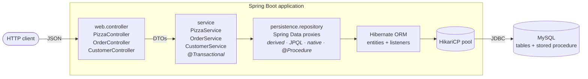
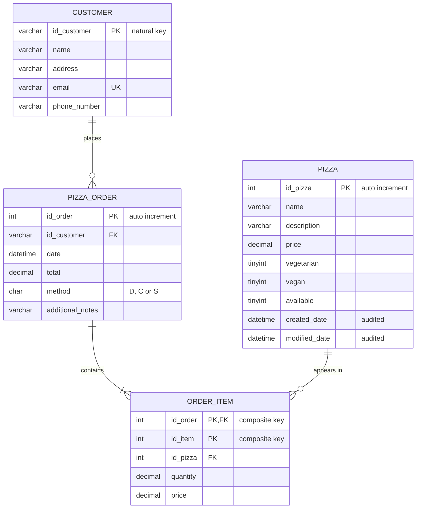
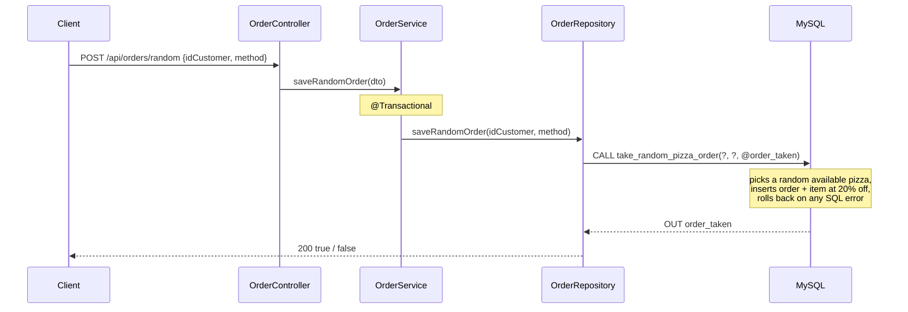

<div align="center">

# Spring Data JPA Showcase

**A Spring Boot 4 REST API that puts Spring Data JPA's persistence techniques side by side — from derived queries to stored procedures — as a working reference on MySQL.**


**English** · [Español](README.es.md)

</div>

---

## Table of contents

- [About](#about)
- [Spring Data JPA features](#spring-data-jpa-features)
- [Tech stack](#tech-stack)
- [Architecture](#architecture)
- [Project structure](#project-structure)
- [Getting started](#getting-started)
- [Technical decisions](#technical-decisions)
- [Author](#author)

---

## About

Spring Data JPA has many ways to reach the database: method names that turn into queries, JPQL, native SQL, projections, modifying queries, stored procedures. Each one is easy to learn on its own. The harder part is knowing **when to use which**. This project puts them together in one small, runnable codebase, with each technique behind its own REST endpoint. You can call an endpoint and read the SQL that Hibernate logs for it.

The code uses a classic three-layer design (**controller → service → repository**) on Spring Boot 4, Hibernate 7 and MySQL. It covers entity mapping, including a natural key and a composite key, bidirectional associations and fetch strategies. It also covers pagination and sorting, transaction boundaries, JPA auditing, entity lifecycle callbacks and calling a stored procedure through `@Procedure`.

The sample data is a small ordering dataset with products, customers, orders and order items. It is only there to give the queries something realistic to work on. The focus of the repository is the **persistence layer**.

---

## Spring Data JPA features

Each feature is implemented in the code and reachable through an endpoint. The full API is in [`docs/api.md`](docs/api.md).

| | Technique | Where in the code | Try it |
|---|---|---|---|
| 🔎 | **Derived query methods**: `True`, `IgnoreCase`, `Containing`, `NotContaining`, `First`, `Top3`, `LessThanEqual`, `OrderBy`, `After`, `In`, `countBy` | `PizzaRepository`, `OrderRepository` | `GET /api/pizzas/with/{ingredient}` |
| 📄 | **Pagination and sorting** with `Pageable`, `PageRequest`, `Sort` and `Page<T>` | `PizzaPageSortRepository` (`ListPagingAndSortingRepository`) | `GET /api/pizzas/available?sort=price` |
| 🧾 | **JPQL** with `@Query` and named `@Param` | `CustomerRepository` | `GET /api/customers/phone/{phone}` |
| 🛢️ | **Native SQL**, including a multi-join `GROUP_CONCAT` aggregation | `OrderRepository` | `GET /api/orders/customer/{id}` |
| 🎯 | **Interface-based projection** mapped from native-query column aliases | `OrderSummary` | `GET /api/orders/summary/{id}` |
| ✏️ | **Modifying query** with `@Modifying` + **SpEL** reading fields from a DTO | `PizzaRepository#updatePrice` | `PUT /api/pizzas/price` |
| ⚙️ | **Stored procedure** call with `@Procedure` and an `OUT` parameter | `OrderRepository#saveRandomOrder` + `database/01-procedures.sql` | `POST /api/orders/random` |
| 🔁 | **Transactions** with `@Transactional` at the service layer | `PizzaService`, `OrderService` | `PUT /api/pizzas/price` |
| 🕓 | **JPA auditing**: `@CreatedDate` / `@LastModifiedDate` in a `@MappedSuperclass` | `AuditableEntity` + `@EnableJpaAuditing` | `POST /api/pizzas` |
| 👂 | **Entity lifecycle callbacks**: `@PostLoad`, `@PostPersist`, `@PostUpdate`, `@PreRemove` | `AuditPizzaListener` | `PUT /api/pizzas` |
| 🔑 | **Composite primary key** with `@IdClass`, plus a natural `String` key | `OrderItemEntity` / `OrderItemId`, `CustomerEntity` | `GET /api/orders` |
| 🔗 | **Associations and fetching**: `@OneToMany(mappedBy)` EAGER with `@OrderBy`, `@ManyToOne`, LAZY `@OneToOne`, read-only `@JoinColumn` | `OrderEntity`, `OrderItemEntity` | `GET /api/orders/today` |
| 🧱 | **Built-in CRUD** from `ListCrudRepository`: `findAll`, `findById`, `save`, `existsById`, `deleteById` | All repositories | `DELETE /api/pizzas/{id}` |

---

## Tech stack

| Technology | Version | Purpose |
|---|---|---|
| Java | 21 | Language and runtime |
| Spring Boot | 4.1.1 | Auto-configuration, embedded server, dependency management |
| Spring Web MVC | 7.0.9 | REST controllers and JSON serialization |
| Spring Data JPA | 4.1.1 | Repository abstraction, query derivation, auditing |
| Hibernate ORM | 7.4.5.Final | JPA provider: entity mapping and SQL generation |
| MySQL | 8.x | Relational database (tested on 8.0 and 8.4) |
| MySQL Connector/J | 9.7.0 | JDBC driver |
| HikariCP | 7.0.2 | JDBC connection pool (Spring Boot default) |
| Jackson | 3.1.5 | JSON serialization of entities and projections |
| Lombok | 1.18.46 | Getters, setters and constructors on entities and DTOs |
| JUnit Jupiter | 6.0.3 | Context-load integration test |
| Maven Wrapper | Maven 3.9.16 | Reproducible build without a local Maven install |

---

## Architecture

The request flow through the layers:



The data model (created by `database/00-schema.sql` and kept in sync with the entities by Hibernate):



What happens on `POST /api/orders/random`, the stored-procedure path:



---

## Project structure

```text
spring-data-jpa-showcase/
├── database/
│   ├── 00-schema.sql              # Tables, keys and indexes
│   ├── 01-procedures.sql          # Stored procedure called through @Procedure
│   └── 02-data.sql                # Sample data (resets the tables)
├── docs/
│   ├── api.md                     # Endpoint reference (English)
│   └── api.es.md                  # Endpoint reference (Spanish)
├── src/
│   ├── main/
│   │   ├── java/com/rodo_pizzeria/
│   │   │   ├── RodoPizzeriaApplication.java   # Entry point; enables JPA repositories and auditing
│   │   │   ├── web/controller/        # REST layer: HTTP mapping and status codes
│   │   │   ├── service/               # Use cases and transaction boundaries
│   │   │   │   └── dto/               # Request payloads that are not entities
│   │   │   └── persistence/
│   │   │       ├── entity/            # JPA entities, composite key, auditing base class, listener
│   │   │       ├── projection/        # Interface projections for read-only queries
│   │   │       └── repository/        # Spring Data repository interfaces
│   │   └── resources/
│   │       └── application.properties # Datasource (env vars) and JPA settings
│   └── test/java/com/rodo_pizzeria/   # Spring context integration test
├── .env.example                   # Environment variables template
├── pom.xml                        # Maven build and dependencies
├── mvnw / mvnw.cmd                # Maven Wrapper
└── LICENSE
```

---

## Getting started

### Prerequisites

- **JDK 21**
- **MySQL 8.x** running locally, **or** Docker to start one in a container
- Git

Maven is not required: the project ships with the Maven Wrapper (`./mvnw`).

### 1. Clone the repository

```bash
git clone https://github.com/RodolGiaco/spring-data-jpa-showcase.git
cd spring-data-jpa-showcase
```

### 2. Create the database and user

**Option A: local MySQL.** Run as an admin user (`sudo mysql` or `mysql -u root -p`):

```sql
CREATE DATABASE pizzeria;
CREATE USER 'pizzeria_user'@'localhost' IDENTIFIED BY 'change_me';
GRANT ALL PRIVILEGES ON pizzeria.* TO 'pizzeria_user'@'localhost';
```

**Option B: MySQL in Docker.** This creates the same database and user:

```bash
docker run -d --name pizzeria-mysql \
  -e MYSQL_ROOT_PASSWORD=root \
  -e MYSQL_DATABASE=pizzeria \
  -e MYSQL_USER=pizzeria_user \
  -e MYSQL_PASSWORD=change_me \
  -p 3306:3306 mysql:8.4
```

> If port `3306` is already taken (for example by a local MySQL), map another one, e.g. `-p 3307:3306`. Then add `-P 3307` to the `mysql` commands and set `DB_URL=jdbc:mysql://localhost:3307/pizzeria` in step 4.

### 3. Load the schema, the stored procedure and the sample data

Run the scripts in order:

```bash
mysql -h 127.0.0.1 -u pizzeria_user -p pizzeria < database/00-schema.sql
mysql -h 127.0.0.1 -u pizzeria_user -p pizzeria < database/01-procedures.sql
mysql -h 127.0.0.1 -u pizzeria_user -p pizzeria < database/02-data.sql
```

> With Docker and no local `mysql` client, replace `mysql -h 127.0.0.1 -u pizzeria_user -p` with `docker exec -i pizzeria-mysql mysql -u pizzeria_user -pchange_me`.

### 4. Configure the environment variables

| Variable | Description | Default |
|---|---|---|
| `DB_URL` | JDBC URL of the database | `jdbc:mysql://localhost:3306/pizzeria?createDatabaseIfNotExist=true` |
| `DB_USERNAME` | Database user | `pizzeria_user` |
| `DB_PASSWORD` | Database password | `admin` |

```bash
cp .env.example .env              # then edit DB_PASSWORD if needed
set -a && source .env && set +a   # export the variables to the current shell
```

### 5. Run the application

```bash
./mvnw spring-boot:run
```

The API starts on `http://localhost:8080`. Try it:

```bash
curl "http://localhost:8080/api/pizzas/available?page=0&element=3&sort=price&sortDirection=ASC"
curl http://localhost:8080/api/orders/summary/1
curl -X POST http://localhost:8080/api/orders/random \
     -H "Content-Type: application/json" \
     -d '{"idCustomer":"863264988","method":"D"}'
```

### 6. Run the tests

```bash
./mvnw test
```

> The test starts the full Spring context, so the database from step 2 must be running.

---

## Technical decisions

- **Spring Data repositories instead of `EntityManager` or `JdbcTemplate`.** All data access goes through repository interfaces. This keeps the service layer free of persistence code and shows how far the abstraction goes, from query derivation up to stored procedures, before you need to write an implementation class.
- **One query style per need.** Derived methods handle simple filters, where the method name is the query. JPQL handles queries that depend on the entity model. Native SQL handles database-specific features such as `GROUP_CONCAT`. The `OrderSummary` projection returns an aggregated view without loading full entity graphs.
- **Associations as read-only views over scalar foreign keys.** Associations use `@JoinColumn(insertable = false, updatable = false)`, so an order is written by setting `idCustomer` and never requires loading a `CustomerEntity`. The association is still there for reading. `@JsonIgnore` on back-references prevents serialization cycles and keeps the LAZY `customer` from loading during JSON rendering.
- **EAGER only where the response always needs it.** Order items are always part of an order's response, so they load EAGER and sorted with `@OrderBy`. The customer is not part of the response, so it stays LAZY.
- **Keys that follow the data.** `customer` uses its natural `String` identifier. `order_item` is identified by `(id_order, id_item)`, mapped with `@IdClass`, so each line number is unique within its order.
- **Transactions at the service layer.** `@Transactional` sits on the service methods that modify data (the `@Modifying` update and the stored procedure call). The use case, not the repository, defines the unit of work.
- **Business logic in a stored procedure where atomicity lives in the database.** The random-promotion order inserts an order and its item in a single database transaction with its own error handler. Spring calls it through `@Procedure` and reads the `OUT` parameter as the method's return value.
- **Auditing through a mapped superclass.** `AuditableEntity` holds the audit columns once, so any entity can inherit them. A separate custom listener shows the low-level JPA callbacks next to Spring's `AuditingEntityListener`.
- **Versioned SQL scripts plus `ddl-auto=update`.** The `database/` scripts give a reproducible setup that includes the stored procedure, which Hibernate cannot generate. `ddl-auto=update` keeps the tables in sync with the entities during development.
- **Configuration from the environment.** Credentials come from environment variables with local defaults, so the same build runs on any machine without editing files.

---

## Author

**Rodolfo Giacomodonatto**

[](https://github.com/RodolGiaco)
[](https://www.linkedin.com/in/rodolfo-giacomodonatto/)

Released under the [MIT License](LICENSE).
